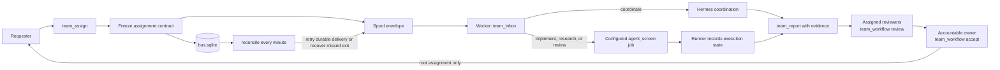

# bot-coms

Standalone bot-to-bot messaging over a **local POSIX filesystem spool**. Delivery is at-least-once; completed handler results are replayable through the idempotency store. External side effects must be idempotent or transactionally coordinated; arbitrary effects are not guaranteed exactly once.

This project does **not** depend on the Hermes A2A gateway or any product repository. HTTP transport is post-MVP (see `docs/HTTP_ADAPTER_SKETCH.md`).

**Team coordination** lives in the sibling package `bot_coms_board` (same repo): `bus.sqlite` ledger, `team_assign` / `team_inbox` / `team_report` Hermes tools, and `bot-coms-board` CLI. See `docs/BOARD.md` and [`docs/WORKFLOWS.md`](docs/WORKFLOWS.md) for configurable responsibilities, frozen ownership, independent review gates and owner acceptance. The transport core never imports the board lane.

MVP requires a **local POSIX** disk (APFS/ext4). NFS and other shared filesystems are unsupported.

## Hermes team layout

The repository is reusable. `$HERMES_HOME/team` is the live deployment: it contains
the current participants, assignments, messages, and operator-specific settings.

```text
bot-coms/                              reusable source and documentation
├── src/bot_coms/                      filesystem message transport
├── src/bot_coms_board/                workflow ledger, contracts, recovery
├── adapters/                          Hermes plugin entry points
├── skills/team-ops/                   agent operating procedure
├── docs/team/                         shared policy and daily prune procedure
└── examples/team/                     local-settings templates

$HERMES_HOME/                          one live Hermes deployment
├── profiles/<profile>/
│   ├── config.yaml                    plugins, tools, model, skill directories
│   ├── .env                           BOT_COMS_SPOOL_ROOT and BOT_COMS_PEER_ID
│   └── memory_store.db                profile-local durable facts
├── team/
│   ├── workflows.json                 peer IDs, capabilities, bindings, policies
│   ├── bus.sqlite                     assignments, contracts, reviews, outbox
│   ├── spool/<peer>/                  at-least-once message inboxes and state
│   ├── context/<slice>.md             assignment bodies and acceptance criteria
│   ├── USAGE.md                       local meter command and budget rules
│   └── workflow-reconcile*.log        scheduler output
└── TEAM.md                            local constraints and escalation route

<operator scheduler>/                  optional operator-owned scheduler
└── <reconcile command>                may call reconcile every minute
```

`workflows.json` names stable peer IDs and their capabilities. It is the directory
for **new** work. Each assignment copies the resolved owner, return peer, activity,
review gates, generation, and revision into `bus.sqlite`; later org edits do not
rewrite an existing assignment.

## How a delivery moves



Execution is not acceptance. A worker reports evidence, every required reviewer
approves the current submission revision, and the accountable owner accepts. Only
root acceptance sends the concise outcome to the assignment's saved origin.

## What owns what

| Component | Responsibility |
|---|---|
| `bot_coms` | Atomic filesystem-spool transport, peer allowlists, claim/ack lifecycle, idempotent worker support. |
| `bot_coms_board` | Assignment ledger, frozen contracts, review/acceptance gates, durable outbox, and reconciliation. |
| Hermes adapters | Expose `team_assign`, `team_inbox`, `team_report`, `team_workflow`, and `team_bus` to a profile. |
| `workflows.json` | Maps stable peer IDs to profiles and capabilities; binds responsibilities to peers; defines policies for new assignments. |
| Profile `config.yaml` and `.env` | Select installed plugins/tools and give each profile its runtime peer identity. |
| `team-ops` skill | Tells agents how to dispatch, receive, report, review, accept, and reassign work. |
| Local `TEAM.md` / `USAGE.md` | Deployment-specific constraints, escalation route, and current budget policy. |
| `docs/team/` | Reusable shared policy, delivery rules, templates, and daily prune procedure. |

## Hermes setup

1. Install this repository into the same Python environment that starts Hermes:

   ```bash
   /path/to/hermes/venv/bin/python3 -m pip install -e /path/to/bot-coms
   ```

   This installs the `bot-coms` and `bot-coms-board` plugin entry points along
   with their adapters. Confirm them with `hermes -p <profile> plugins list`.

2. Enable both plugins for every team profile and expose their toolsets. Add the
   shared skill directory, then set the profile's peer identity:

   ```yaml
   plugins:
     enabled: [bot-coms, bot-coms-board]
   platform_toolsets:
     cli: [team_bus, bot_coms, memory, file]
   skills:
     external_dirs: [/path/to/bot-coms/skills]
   ```

   ```dotenv
   BOT_COMS_SPOOL_ROOT=/path/to/hermes/team/spool
   BOT_COMS_PEER_ID=<stable-peer-id>
   ```

   Add `agent-screen`, `agent_screen`, and narrowly scoped write settings only
   to profiles authorized to launch coding agents.

3. Create `$HERMES_HOME/team/workflows.json` from
   [`examples/workflows.json`](examples/workflows.json). Register the same peer
   IDs in the spool with `bot-coms init-spool --root <spool> --peers <peer-ids>`.
   Then add local TEAM and usage settings from
   [`examples/team/`](examples/team/).

4. Each `team_inbox` check reclaims stale leases for that peer and reconciles
   pending delivery and missed runner exits before reading messages. No scheduler
   is required if recovery can wait for the next inbox check. Optionally run
   `bot-coms-board reconcile` from an existing scheduler for recovery while the
   team is idle. Recovery never starts coding-agent jobs or resumes historical work.

5. Smoke-test a bounded `activity="coordinate"` assignment. Verify its frozen
   contract with `team_workflow describe`, submit a report, and accept it from
   the assigned owner. Receipts and internal reports must stay internal.

After an upgrade, reinstall into the Hermes runtime, start a fresh Hermes session
or reload plugins, and run the smoke test again. The active deployment can be
checked with `hermes -p <profile> plugins list`, `bot-coms-board reconcile`, and
`team_workflow describe`.

## Quickstart

```bash
python -m venv .venv && source .venv/bin/activate
pip install -e ".[dev]"

bot-coms init-spool --root /tmp/bot-coms-demo --peers a,b
echo '{"hello":"world"}' > /tmp/p.json
bot-coms send --root /tmp/bot-coms-demo --from a --to b --type request --payload-file /tmp/p.json
bot-coms claim --root /tmp/bot-coms-demo --peer b
# copy the id from the claim output, then:
bot-coms ack --root /tmp/bot-coms-demo --peer b --id <ID>
```

Library:

```python
from pathlib import Path
from bot_coms import Client, Worker, init_spool

root = Path("/tmp/bot-coms-demo")
init_spool(root, ["a", "b"])
a = Client(root, "a")
b = Client(root, "b")

env = a.send("b", "request", {"hello": "world"}, reply_to="a")
claimed = b.claim()
b.ack(claimed, result={"ok": True})
```

Handler contract: the transport may deliver the same logical message more than once. Before side effects, call through `Worker` (which gates on the idempotency store) or make the handler idempotent yourself.

## Tests

```bash
python -m pytest tests/unit tests/smoke -q
bot-coms smoke --all
```

## Hermes adapter

See `docs/INSTALL.md` and `adapters/hermes_bot_coms/README.md`. Enablement is a **user** action (`hermes plugins enable bot-coms`); this package does not rewrite Hermes config.

## Docs

- [Quick operational audit](docs/AUDIT.md) — repeatable live checks and inbox recovery expectations
- [Team documents](docs/team/README.md) — shared policy, local settings templates and daily prune
- [Provision a Hermes teammate](skills/team-ops/references/provision.md) — fresh profiles, shared policy and capability registration
- [`docs/PROTOCOL.md`](docs/PROTOCOL.md) — normative envelope, layout, and lifecycle
- [`docs/NON_GOALS.md`](docs/NON_GOALS.md)
- [`docs/INSTALL.md`](docs/INSTALL.md)
- [`docs/HTTP_ADAPTER_SKETCH.md`](docs/HTTP_ADAPTER_SKETCH.md) — post-MVP only
